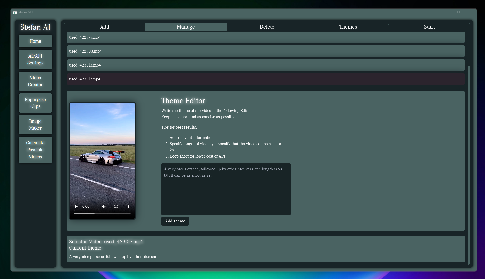
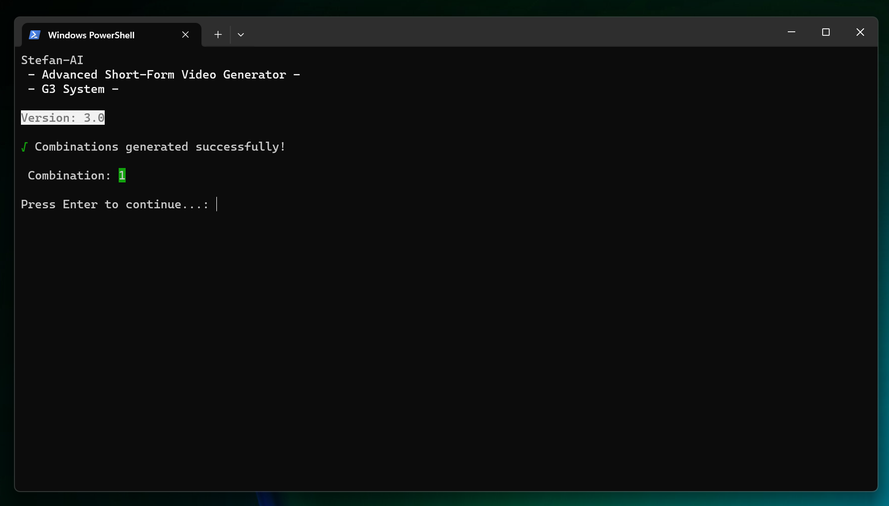
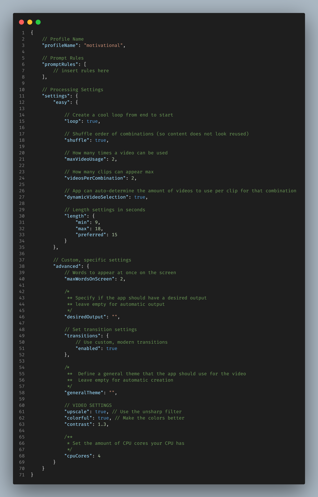
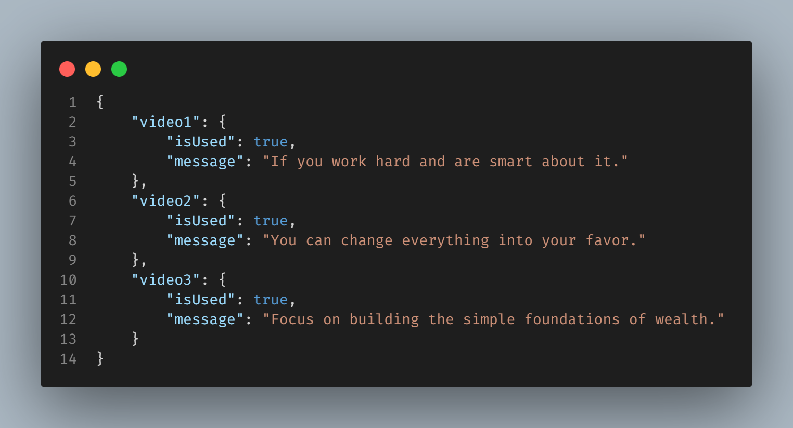

  

# Stefan AI 3 

 
  

<b>Motto: </b>”Stefan AI 3 is incredible. Therefore, when a supposed Version 4 comes out, it will be the most successful software made.”

Before starting, I would like to announce that version 3 will be a very long-term solution. Maybe 3.1, 3.2, 3.3 will exist, but 4.0 will not come soon, thats for sure. Just like Windows 10 or perhaps GTA 5, we will use the exisiting platform until it literally can't be used anymore and we will have to innovate once again.

<h3 style="font-size: 1.7rem">The Most Advanced Automated Social Media Content Maker</h3>

    Stefan AI 3 improves in many ways over Stefan AI 2. It has a better UI,
    it is more cost-efficient, it is more faster, yet it  integrates <b>NEW</b> features that will maximise your profits on social media.  

<h3 style="font-size: 1.7rem; margin-top: 20px">The brand new <b>Theme Editor</b></h3>

    The revised app has new, cutting-edge features, such as this easy to use <b>Theme Editor</b>

    The theme editor provides the user with a very easy to use <b>interface,</b> which allows you to specify to the  system, how to process each video. 

<h3 style="font-size: 1.7rem; margin-top: 20px">Improved Terminal Output</h3>

    Get to know what is happening with the better <b>CLI</b> interface design. Here is a snapshot from early development of how it looks, with most of its elements.

<h3 style="font-size: 1.7rem; margin-top: 20px">Powerful Configuration File</h3>

    The <b>Powerful</b> configuration file in the .jsonc format was kept from the old app. It allows a lot of user control. An <b>experienced</b> user, with trial and error, can use this file and make videos <b>better </b> than <b> most video editors</b> can, in just <b>2 minutes.</b>

  

<h3 style="font-size: 1.7rem; margin-top: 20px">Custom Trained AI</h3>

    Using a <b>”Fine-Tuned” OpenAI LLM</b>, the app can produce <b>high-quality</b> video scripts.
    The app is trained to return the output in a special <b>.json</b> format:

 

<h3 style="font-size: 1.7rem; margin-top: 20px">Comparison in between apps</h3>

|         | Stefan AI 1 (VideoAutomation) | Stefan AI 2 | <b>Stefan AI 3</b> |
| -------- | -------- | -------- | -------- |
| Output video,   editing capabilities  | 1.5/10  | 8/10  | 9/10  |
| AI Script Generation | Poor | Very Good (User-Settings play a big role)  | Very Good (User-Settings play a big role) |
| App Size | Very Low   ~400mb | Big   ~10GB - 20GB | Bigger   ~15GB - 25GB |
| Speed  rating | Fast (AI Dependant) | Slow | Tolerable |
| Overall Capabilities, what it can output | Always was 15 seconds, very poor editing, 720p, Basic Subtitles, Motivational Content only, added music automatically | Outputs a wide range of content depending on how you configured the profile, 1080p Standard and only choice, 60fps, nice transitions, asthetic subtitles, leaves user to decide if they want to add music through social-media platform, videos did not have a fixed length, although, the app worked best whilst producing videos in between 9s to 15s. | Video Generation System remade from Stefan AI 2 but more immune to errors, State of the Art image generator that takes input images to create an output slideshow for TikTok. Could also repurpose Videos by adding subtitles, it uses your existing profile to process it. 1080p standard and only choice for all video types and *high-resolution images outputted.  |

<h3 style="font-size: 1.7rem; margin-top: 20px">Technologies Used</h3>

 
 
 
 
  
 
 
   
 
 

<h3 style="font-size: 1.7rem; margin-top: 20px">New Approach To Complex Problems</h3>
In Stefan AI 3, it will feature specialised tools to make certain categories of videos. Here are the systems in depth

 

|         | Generate 3 (G3) | Repurpose 1 (R1) | AE75-1 (Auto-Edit 75% Gen 1) | RS1 (Reddit Stories 1) | FM1 (Funny Moments 1) |
| -------- | -------- | -------- | -------- | ------ | ------ |
| Finished | Yes | No | No | In Progress | No |
| Rating | 8/10 | N\A | N\A | N\A | N\A |
|  |  |  |  |  |  |